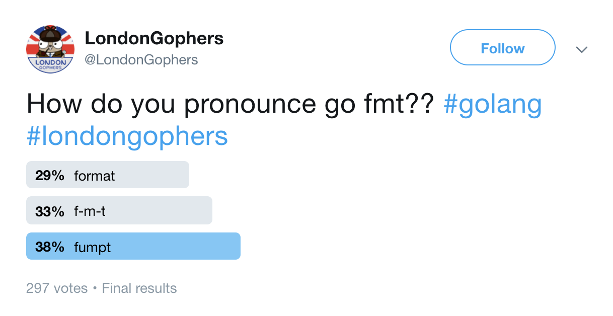

# Hello World Anatomy

any_name.go
```go
package main

import "fmt"

func main() {
        fmt.Println("gophers")
}
```

Create this file anywhere, and run `go run any_name.go`

Let's break this file down:

`any_name.go`
  - Filenames are generally snake_case.
  - Filenames do not matter to the go compiler.

`package main`
  - Every file in go belongs to a package which is stated in the first line of the file.
  - `main` tells the Go compiler that the package should compile as an executable program instead of a shared library.

`import "fmt"`
  - "fmt" is a package in the stdlib.
  - Package names are lowercase, and have no underscores.
  - Packages help group data and logic together.

`func main() {`
  - Functions are declared with the `func` keyword.
  - The `main` function is the entrypoint into the executable.

`fmt.Println("gophers")`
  - `Println` is a function in the `fmt` package.
  - `Println` is capitalized, making it **exported** and a part of the package's public API.
  - The `Println` function from the fmt package is being used to print "gophers".
  - go uses tabs, not spaces ([which means you'll get paid less](https://stackoverflow.blog/2017/06/15/developers-use-spaces-make-money-use-tabs/)).

`}`
  - This is the end of the `main` function.
  - When `main` exits, the program will stop.

## Exercises

To compile this, run `go build any_name.go`

To run the executable, run `./any_name`

To run without creating an executable, run `go run any_name.go`


## Tips

Go has great documentation: Try `go doc fmt` and `go doc fmt Println`, or see it [online](https://golang.org/pkg/).



## Further Reading

`go help build`

`go help run`

---

[prev](1.1.md) -- [up](Readme.md) -- [next](1.3.0.md)